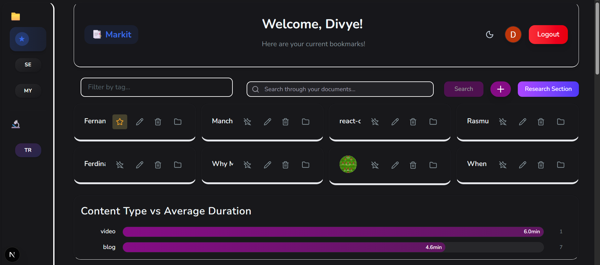
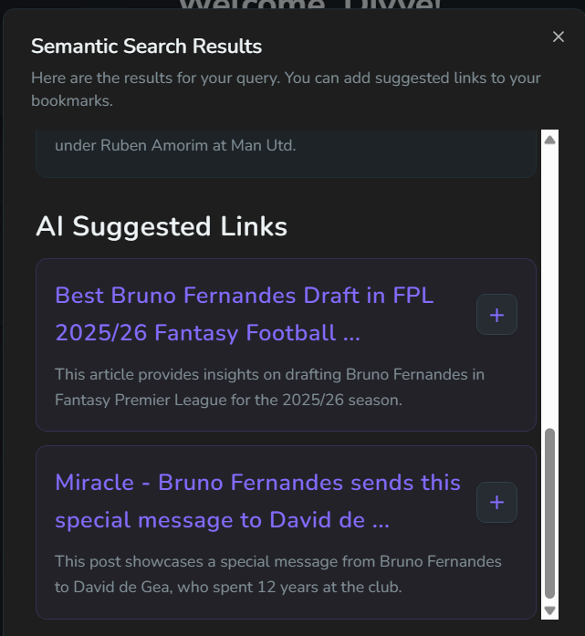
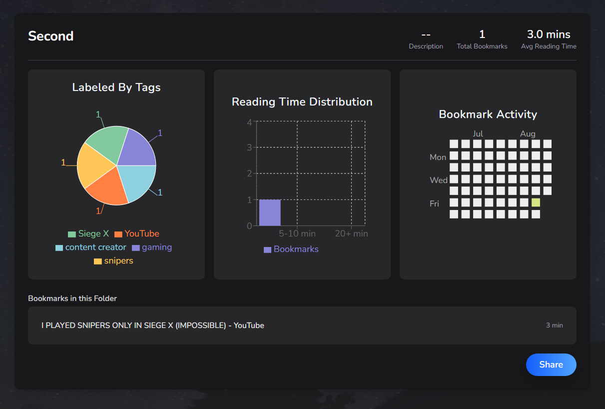
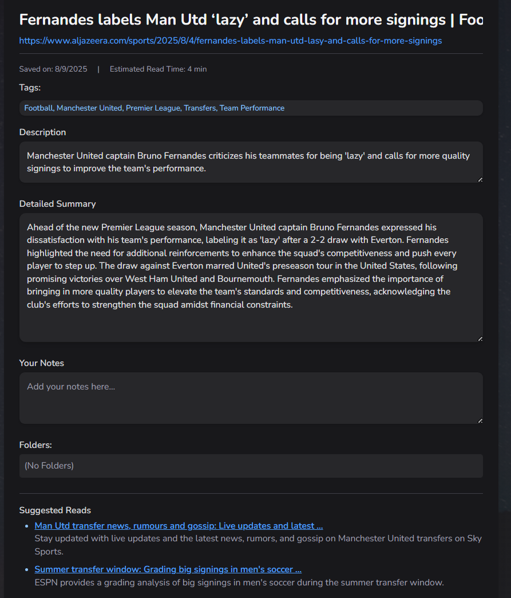

# 🔖 Markit - AI-Powered Bookmark Manager

[](https://markit-cyan.vercel.app)
[](https://chromewebstore.google.com/detail/markit-extension/fldckombbmfbofffoochjliminimppjl)
[](https://nextjs.org/)
[](https://supabase.com/)
[](https://openai.com/)

> Transform your bookmarks into an intelligent knowledge base with AI-powered enrichment, semantic search, and advanced analytics.

## ✨ Features

### 🤖 AI-Powered Magic Save



- **Content Scraping**: Automatically extracts full content from any URL
- **AI Enrichment**: Generates summaries, tags, reading time estimates, and content type classification using GPT-3.5
- **Smart Tagging**: Auto-generates relevant topic tags for better organization
- **Content Analysis**: Creates both concise and detailed summaries for comprehensive understanding

### 🔍 Semantic Search



- **Context-Aware Search**: Uses OpenAI embeddings for meaning-based search, not just keywords
- **Natural Language Queries**: Find content with queries like "articles about React performance optimization"
- **AI-Enhanced Results**: Provides intelligent search result summaries and suggested related content
- **Google Integration**: Fetches fresh, relevant content suggestions from Google Custom Search

### 📊 Advanced Analytics & Visualizations



- **Content Type Analysis**: Interactive charts showing distribution of articles, videos, PDFs, and other content types
- **Bookmark Cluster Maps**: Heatmap visualization of content categories with interactive exploration
- **Folder Analytics**: Comprehensive dashboards with pie charts, bar charts, and timeline heatmaps
- **Knowledge Gap Analysis**: AI-powered insights into learning patterns and content gaps
- **Reading Time Tracking**: Aggregated analytics on content consumption patterns

### 🗂️ Smart Organization

- **Dynamic Folders**: Create, organize, and manage bookmark collections with real-time analytics
- **Multi-Folder Support**: Bookmarks can belong to multiple folders with dynamic relationship tracking
- **Tag-Based Filtering**: Advanced filtering system with AI-generated and custom tags
- **Priority System**: Visual priority indicators for different types of content

### 🎨 Modern UI/UX



- **Responsive Design**: Seamless experience across desktop, tablet, and mobile devices
- **Dark/Light Themes**: Elegant theme system with smooth transitions
- **Glass Morphism**: Modern design with backdrop blur effects and smooth animations
- **Interactive Cards**: Hover effects, micro-animations, and intuitive navigation
- **Real-Time Updates**: Live data synchronization using React Query

### 🔌 Browser Extension

- **One-Click Saving**: Instant bookmark saving from any webpage
- **Smart Content Detection**: Automatically adapts UI based on content type (video, article, documentation)
- **Seamless Authentication**: Secure token-based auth with automatic session management
- **Cross-Platform Sync**: Real-time synchronization between web app and extension

## 🏗️ Technical Architecture

### Frontend Stack

- **Next.js 14** with App Router for modern React development
- **TailwindCSS v4** for responsive, utility-first styling
- **Framer Motion** for smooth animations and micro-interactions
- **React Query** for efficient data fetching and caching
- **TypeScript** for type-safe development

### Backend & Database

- **Supabase** as serverless backend with PostgreSQL database
- **Row-Level Security** for secure, user-specific data access
- **Real-time subscriptions** for live data updates
- **Edge Functions** for AI processing and external API integration

### AI Integration

- **OpenAI GPT-3.5 Turbo** for content analysis and summarization
- **OpenAI Embeddings** for semantic search capabilities
- **Google Custom Search API** for content discovery and suggestions
- **Smart caching** to optimize AI API usage and response times

### Visualization Libraries

- **Recharts** for folder analytics (pie charts, bar charts)
- **Heatmap.js** for bookmark cluster visualizations
- **React Calendar Heatmap** for timeline activity tracking
- **Custom D3.js components** for advanced data visualizations

## 🚀 Getting Started

### Prerequisites

- Node.js 18+
- npm or yarn
- Supabase account
- OpenAI API key
- Google Custom Search API credentials

### Installation

1. **Clone the repository**

   ```bash
   git clone https://github.com/yourusername/markit.git
   cd markit
   ```

2. **Install dependencies**

   ```bash
   npm install
   ```

3. **Set up environment variables**

   ```bash
   cp .env.example .env.local
   ```

   Configure the following variables:

   ```env
   NEXT_PUBLIC_SUPABASE_URL=your_supabase_url
   NEXT_PUBLIC_SUPABASE_ANON_KEY=your_supabase_anon_key
   OPENAI_API_KEY=your_openai_api_key
   GOOGLE_API_KEY=your_google_api_key
   GOOGLE_CSE_ID=your_custom_search_engine_id
   NEXT_PUBLIC_URL=http://localhost:3000
   ```

4. **Set up Supabase database**

   - Create tables for users, bookmarks, and folders
   - Configure Row-Level Security policies
   - Enable Google OAuth authentication

5. **Run the development server**

   ```bash
   npm run dev
   ```

6. **Set up browser extension** (optional)
   - Navigate to `chrome://extensions/`
   - Enable "Developer mode"
   - Load unpacked extension from `/extension` folder

## 📱 Browser Extension Setup

### Development

1. Update `extension/manifest.json` for localhost:

   ```json
   "matches": ["http://localhost:3000/*"]
   ```

2. Update `extension/content.js` origin check:
   ```javascript
   if (event.origin !== "http://localhost:3000") return;
   ```

### Production

1. Update extension configuration for your deployment domain
2. Create production build ZIP file
3. Submit to Chrome Web Store

## 🗃️ Database Schema

### Core Tables

```sql
-- Users table (handled by Supabase Auth)
users (
  id UUID PRIMARY KEY,
  email TEXT,
  name TEXT,
  created_at TIMESTAMP
)

-- Bookmarks table
bookmarks (
  id UUID PRIMARY KEY,
  user_id UUID REFERENCES users(id),
  url TEXT NOT NULL,
  title TEXT,
  summary TEXT,
  bigger_summary TEXT,
  tags TEXT[],
  content_type TEXT,
  reading_time INTEGER,
  notes TEXT,
  is_favorite BOOLEAN DEFAULT false,
  embedding VECTOR(1536), -- OpenAI embeddings
  created_at TIMESTAMP DEFAULT NOW()
)

-- Folders table
folders (
  id UUID PRIMARY KEY,
  user_id UUID REFERENCES users(id),
  name TEXT NOT NULL,
  description TEXT,
  bookmark_ids UUID[],
  doc_count INTEGER DEFAULT 0,
  created_at TIMESTAMP DEFAULT NOW()
)
```

## 🔧 API Endpoints

### Core Endpoints

- `POST /api/magic-save` - AI-powered bookmark enrichment
- `POST /api/semantic-search` - Semantic search with embeddings
- `GET /api/folder-insights` - AI-generated folder analytics
- `GET /api/knowledge-gaps` - Find AI Assisted Weakpoints

### Magic Save Pipeline

1. Content scraping and metadata extraction
2. OpenAI GPT-3.5 processing for summaries and tags
3. Embedding generation for semantic search
4. Database storage with real-time updates

## 🎯 Key Features Deep Dive

### Content Type Detection & Analytics

The app automatically categorizes content and provides rich analytics:

- **Article Detection**: Blog posts, news articles, documentation
- **Video Recognition**: YouTube, Vimeo, educational content
- **Technical Content**: GitHub repositories, Stack Overflow, CodePen
- **Social Media**: Twitter/X posts, Reddit discussions
- **Document Types**: PDFs, presentations, research papers

### AI-Powered Insights

- **Learning Gap Analysis**: Identifies areas where you need more content
- **Content Clustering**: Groups related bookmarks using ML algorithms
- **Trend Analysis**: Tracks your learning and research patterns over time
- **Smart Recommendations**: Suggests related content based on your interests

### Advanced Search Capabilities

- **Semantic Understanding**: Finds content by meaning, not just keywords
- **Multi-field Search**: Searches across titles, content, summaries, and tags
- **Contextual Results**: AI explains how results relate to your query
- **Fresh Content Discovery**: Integrates live web search for new resources

## 🎨 Design System

### Color Palette

- **Light Theme**: Vibrant purple-blue gradients with high contrast
- **Dark Theme**: Rich dark blues with accent colors
- **UI Elements**: Consistent color system with semantic naming

### Typography

- **Headings**: Nunito font family with responsive sizing
- **Body Text**: Optimized line heights and spacing for readability
- **Code**: Geist Mono for technical content

### Animations

- **Page Transitions**: Smooth slide and fade animations
- **Micro-interactions**: Hover effects, button presses, loading states
- **Data Visualizations**: Animated charts and interactive elements

## 🔒 Security & Privacy

- **Row-Level Security**: Supabase RLS ensures users only access their data
- **JWT Authentication**: Secure token-based authentication system
- **API Rate Limiting**: Prevents abuse of AI and external APIs
- **Data Encryption**: All sensitive data encrypted at rest and in transit

## 📈 Performance Optimizations

- **React Query Caching**: Intelligent data caching and background updates
- **Image Optimization**: Next.js automatic image optimization
- **Code Splitting**: Dynamic imports for better loading performance
- **AI Response Caching**: Smart caching to reduce OpenAI API calls
- **Database Indexing**: Optimized queries with proper indexing

## 🤝 Contributing

We welcome contributions! Please see our [Contributing Guide](CONTRIBUTING.md) for details.

### Development Workflow

1. Fork the repository
2. Create a feature branch
3. Make your changes
4. Add tests if applicable
5. Submit a pull request

## 📄 License

This project is licensed under the MIT License - see the [LICENSE](LICENSE) file for details.

## 🙏 Acknowledgments

- [OpenAI](https://openai.com/) for powerful AI capabilities
- [Supabase](https://supabase.com/) for seamless backend infrastructure
- [Vercel](https://vercel.com/) for excellent deployment platform
- [Tailwind CSS](https://tailwindcss.com/) for utility-first styling
- [Recharts](https://recharts.org/) for beautiful data visualizations

## 📞 Support

- 📧 Email: support@markit.app
- 💬 Discord: [Join our community](https://discord.gg/markit)
- 🐛 Issues: [GitHub Issues](https://github.com/yourusername/markit/issues)
- 📖 Documentation: [Full Documentation](https://docs.markit.app)

---

<div align="center">
  <strong>Built with ❤️ by developers, for developers</strong>
  <br>
  <sub>Star ⭐ this repo if you find it helpful!</sub>
</div>
